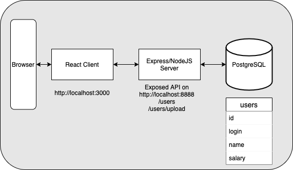

# Employee Salary Management MVP

> .env file will be uploaded for the purpose of development/testing in your local environment only

## Set up development environment / run application
1. Run `docker-compose up app` in the root directory to start the nodejs backend service. 
2. Run `docker-compose up web` in the root directory to web service.

## Set up test environment
1. Run `docker-compose up testdb` in the root directory to start the test database.
2. Run `npm run test` in the root directory to run all unit tests. 

## Assumptions
1. CSV File will always contain a header
2. Uploading a file that contains a new id but existing login will result in an error.
3. Uploading a file that contains an existing id with a different but existing login will result in a swap of logins between the 2 affected rows in the table.
4. Default settings for min and max salary on the front end are 0 and 100000000 respectively.
5. id, login and name field can have a max length of up to 100 characters while salary has a precision of 10 and a scale of 2.

## Completed Tasks
1. User Story #1
2. User Story #2
3. User Story #3 (backend CRUD endpoints & responsive web app)

## Design 

